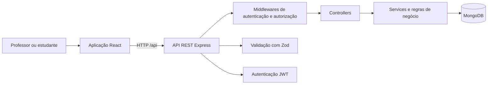

# RadarAprende

Plataforma de avaliação diagnóstica que ajuda professores a identificar dificuldades de aprendizagem, acompanhar o desempenho dos estudantes por habilidade e tomar decisões pedagógicas orientadas por dados.

Projeto desenvolvido para o **Hackathon 6FSDT**.

---

## Sobre o projeto

Em uma turma, a nota final nem sempre mostra exatamente onde o estudante está encontrando dificuldades.

O RadarAprende organiza o processo de avaliação diagnóstica para permitir que o professor:

- cadastre turmas e estudantes;
- organize habilidades de aprendizagem;
- crie e publique avaliações;
- acompanhe a participação da turma;
- analise o desempenho por questão e habilidade;
- identifique estudantes que precisam de atenção;
- receba recomendações de intervenção pedagógica.

Para o estudante, a plataforma oferece um ambiente direto e acessível para visualizar, responder, revisar e enviar avaliações.

---

## Problema

Professores precisam transformar resultados de avaliações em ações pedagógicas, mas esse processo pode exigir:

- correção manual;
- consolidação de resultados;
- comparação entre estudantes;
- identificação das habilidades com maior dificuldade;
- definição das intervenções mais urgentes.

O RadarAprende centraliza esse fluxo e transforma respostas individuais em indicadores pedagógicos para toda a turma.

---

## Solução

A plataforma possui dois ambientes protegidos por perfil:

| Perfil | Principais recursos |
|---|---|
| Professor | Dashboard, turmas, estudantes, habilidades, avaliações, publicação, resultados e recomendações pedagógicas |
| Estudante | Avaliações publicadas, resolução das questões, revisão das respostas, envio e resultado individual |

O acesso às rotas e aos dados é controlado por autenticação JWT e autorização baseada no papel do usuário.

---

## Fluxo principal

1. O professor entra na plataforma.
2. Cadastra ou seleciona uma turma.
3. Adiciona os estudantes.
4. Cadastra as habilidades avaliadas.
5. Cria uma avaliação diagnóstica.
6. Adiciona questões e alternativas.
7. Publica a avaliação.
8. O estudante acessa a plataforma pela matrícula.
9. Responde, revisa e envia a avaliação.
10. O sistema corrige as respostas automaticamente.
11. O professor acompanha resultados e participação.
12. O RadarAprende apresenta o desempenho por habilidade e recomendações pedagógicas.

---

## Funcionalidades

### Professor

- autenticação por e-mail e senha;
- dashboard com visão geral das turmas e avaliações;
- criação, listagem, arquivamento e restauração de turmas;
- cadastro e listagem de estudantes;
- associação e remoção de estudantes em turmas;
- cadastro e consulta de habilidades;
- criação de avaliações em rascunho;
- inclusão de questões e alternativas;
- publicação de avaliações;
- acompanhamento de estudantes participantes e pendentes;
- análise da taxa de acerto por questão;
- análise de desempenho por habilidade;
- classificação de níveis de aprendizagem;
- recomendações pedagógicas ordenadas por prioridade.

### Estudante

- autenticação por matrícula e senha;
- visualização das avaliações publicadas para sua turma;
- abertura de uma avaliação sem exposição das respostas corretas;
- seleção e alteração de alternativas;
- revisão antes do envio;
- envio único da avaliação;
- correção automática;
- visualização do resultado individual.

### Experiência e acessibilidade

- interface responsiva para diferentes tamanhos de tela;
- navegação separada para professor e estudante;
- estados de carregamento, erro e ausência de dados;
- foco gerenciado durante mudanças de rota;
- estrutura semântica de páginas;
- mensagens de feedback para ações importantes;
- prevenção de acesso entre perfis;
- identidade visual própria do RadarAprende.

---

## Tecnologias

### Front-end

- React
- TypeScript
- Vite
- React Router
- Lucide React
- CSS responsivo

### Back-end

- Node.js
- Express
- TypeScript
- MongoDB
- Mongoose
- Zod
- JSON Web Token
- bcryptjs

### Testes e qualidade

- Vitest
- Supertest
- MongoDB Memory Server
- V8 Coverage
- ESLint
- TypeScript
- testes de integração da API

---

## Arquitetura



O front-end consome a API REST. Durante o desenvolvimento, o Vite encaminha as requisições iniciadas por `/api` para o servidor local.

A API separa as responsabilidades em:

```text
rota
  → middleware
    → controller
      → schema
        → service
          → model
            → MongoDB
```

---

## Estrutura do projeto

```text
radar-aprende/
├── client/
│   ├── src/
│   │   ├── components/
│   │   ├── contexts/
│   │   ├── hooks/
│   │   ├── layouts/
│   │   ├── lib/
│   │   ├── pages/
│   │   ├── services/
│   │   └── styles/
│   ├── .env.example
│   ├── package.json
│   └── vite.config.ts
│
├── server/
│   ├── src/
│   │   ├── config/
│   │   ├── controllers/
│   │   ├── database/
│   │   ├── errors/
│   │   ├── middlewares/
│   │   ├── models/
│   │   ├── routes/
│   │   ├── schemas/
│   │   ├── services/
│   │   └── tests/
│   ├── .env.example
│   ├── package.json
│   └── vitest.config.ts
│
├── docs/
├── package.json
└── README.md
```

---

## Requisitos

Antes de iniciar, instale:

- Node.js 22;
- npm 10;
- uma instância do MongoDB ou um cluster no MongoDB Atlas;
- Git.

Confira as versões:

```bash
node --version
npm --version
git --version
```

---

## Instalação

Clone o repositório:

```bash
git clone https://github.com/Gioh-Workplace/Radar-aprende.git
cd Radar-aprende
```

Instale as dependências da raiz:

```bash
npm install
```

Instale as dependências do back-end:

```bash
npm --prefix server install
```

Instale as dependências do front-end:

```bash
npm --prefix client install
```

---

## Variáveis de ambiente

### Back-end

Crie o arquivo:

```text
server/.env
```

No Windows:

```bat
copy server\.env.example server\.env
```

Conteúdo esperado:

```env
PORT=3333
NODE_ENV=development
MONGODB_URI=mongodb+srv://<usuario>:<senha>@<cluster>.mongodb.net/radaraprende-dev?appName=RadarAprende
JWT_SECRET=substitua-por-uma-chave-segura
JWT_EXPIRES_IN=1d
SEED_DATABASE_NAME=radaraprende-dev
```

A variável `SEED_DATABASE_NAME` deve corresponder exatamente ao banco definido na conexão do MongoDB.

Nunca versione o arquivo `server/.env`.

### Front-end

Crie o arquivo:

```text
client/.env
```

No Windows:

```bat
copy client\.env.example client\.env
```

Conteúdo para desenvolvimento local:

```env
VITE_API_URL=/api
```

O Vite encaminha `/api` para:

```text
http://localhost:3333
```

Nunca versione o arquivo `client/.env`.

---

## Dados demonstrativos

O projeto possui um seed que prepara:

- um professor;
- estudantes;
- turmas;
- habilidades;
- avaliações publicadas;
- uma avaliação em rascunho;
- submissões com diferentes níveis de desempenho;
- resultados e recomendações pedagógicas.

> **Atenção:** o seed remove os dados existentes do banco configurado antes de criar os dados demonstrativos. Use apenas em um banco de desenvolvimento.

Execute:

```bash
npm --prefix server run seed:demo
```

O seed possui proteções que impedem sua execução quando:

- `NODE_ENV` está configurado como `production`;
- a opção de reset não está presente;
- `SEED_DATABASE_NAME` não foi definida;
- o banco conectado não corresponde ao banco autorizado.

---

## Credenciais de demonstração

### Professor

```text
E-mail: professor@radaraprende.demo
Senha: Professor123
```

### Estudante

```text
Matrícula: ALUNO001
Senha: Aluno123
```

Os demais estudantes gerados pelo seed utilizam matrículas sequenciais, como `ALUNO002`, `ALUNO003` e seguintes, com a mesma senha demonstrativa.

---

## Executando o projeto

Na raiz:

```bash
npm run dev
```

Esse comando inicia front-end e back-end simultaneamente.

### Endereços locais

```text
Aplicação: http://localhost:5173
API:       http://localhost:3333
Health:    http://localhost:3333/health
```

Também é possível executar cada parte separadamente.

Back-end:

```bash
npm run dev:backend
```

Front-end:

```bash
npm run dev:frontend
```

---

## Rotas da aplicação

### Professor

```text
/professor
/professor/turmas
/professor/turmas/:classroomId
/professor/habilidades
/professor/avaliacoes
/professor/avaliacoes/:assessmentId
/professor/avaliacoes/:assessmentId/resultados
```

### Estudante

```text
/aluno
/aluno/avaliacoes/:assessmentId
```

### Autenticação

```text
/login
```

---

## Testes

Execute toda a validação do projeto:

```bash
npm run check
```

Esse comando executa:

### Back-end

- verificação de tipos;
- testes automatizados;
- relatório de cobertura;
- build de produção.

### Front-end

- ESLint;
- verificação do TypeScript;
- build de produção.

Para executar apenas os testes do servidor:

```bash
npm --prefix server run test
```

Para gerar o relatório de cobertura:

```bash
npm --prefix server run test:coverage
```

O relatório HTML é gerado em:

```text
server/coverage/index.html
```

---

## Cobertura mínima

O projeto exige cobertura global mínima de **80%** em todas as métricas:

| Métrica | Mínimo |
|---|---:|
| Statements | 80% |
| Branches | 80% |
| Functions | 80% |
| Lines | 80% |

Uma regressão abaixo desses valores faz a etapa de qualidade falhar.

---

## Comandos úteis

| Comando | Descrição |
|---|---|
| `npm run dev` | Inicia front-end e back-end |
| `npm run dev:backend` | Inicia somente a API |
| `npm run dev:frontend` | Inicia somente o front-end |
| `npm run check` | Executa a validação completa |
| `npm --prefix server run test` | Executa os testes do back-end |
| `npm --prefix server run test:coverage` | Gera o relatório de cobertura |
| `npm --prefix server run seed:demo` | Recria os dados demonstrativos |
| `npm --prefix client run build` | Gera o build do front-end |
| `npm --prefix server run build` | Gera o build do back-end |

---

## Roteiro de demonstração

### Ambiente do professor

1. Entrar com a conta demonstrativa do professor.
2. Apresentar o dashboard.
3. Abrir uma turma e verificar seus estudantes.
4. Abrir as habilidades cadastradas.
5. Visualizar uma avaliação publicada.
6. Acessar os resultados.
7. Mostrar participação, desempenho por questão e habilidades.
8. Apresentar as recomendações pedagógicas.

### Ambiente do estudante

1. Sair da conta do professor.
2. Entrar com `ALUNO001`.
3. Visualizar as avaliações disponíveis.
4. Abrir uma avaliação.
5. Responder às questões.
6. Revisar as respostas.
7. Enviar a avaliação.
8. Visualizar o resultado.

---

## Segurança

- senhas armazenadas com hash bcrypt;
- autenticação com JSON Web Token;
- separação de permissões por papel;
- proteção das rotas privadas;
- validação das entradas com Zod;
- isolamento de dados entre professores;
- respostas corretas não são enviadas antes da submissão;
- prevenção de múltiplas submissões para a mesma avaliação;
- arquivos `.env` mantidos fora do versionamento.

---

## Estado do projeto

O MVP do RadarAprende está funcional e validado localmente.

O fluxo completo disponível contempla:

```text
professor
  → turma
    → estudantes
      → habilidades
        → avaliação
          → publicação
            → resposta do estudante
              → correção automática
                → análise pedagógica
```

---

## Contexto acadêmico

Projeto desenvolvido para o **Hackathon 6FSDT**, com foco na aplicação de desenvolvimento full stack para resolver um desafio relacionado à educação e à avaliação da aprendizagem.